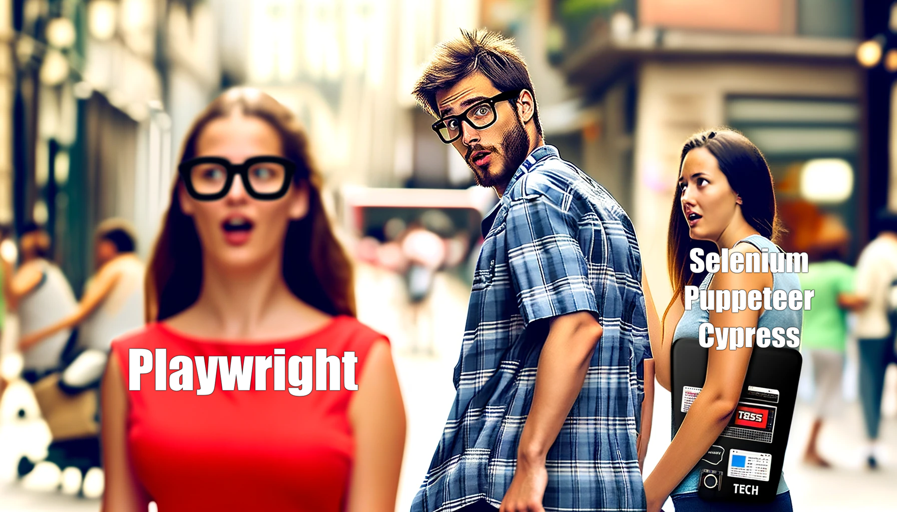

# Заключение(база)

Playwright является мощным и гибким инструментом для автоматизированного тестирования веб-приложений. Этот инструмент предоставляет широкие возможности для эмуляции мобильных устройств, поддержки различных браузеров и реализации сложных сценариев тестирования. Playwright также интегрируется с популярными CI/CD системами, что делает его идеальным выбором для современных процессов разработки и тестирования.

---

[Содержание](../sections.md)
